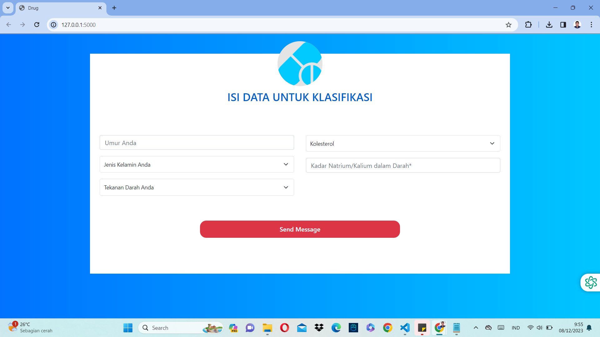
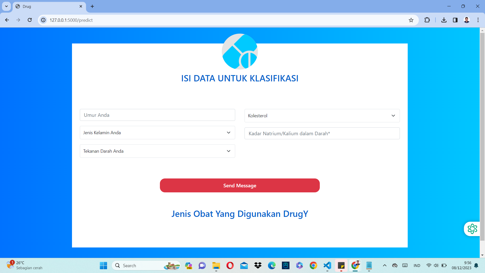

# KLASIFIKASI JENIS OBAT

Klasifikasi jenis obat memanfaatkan algoritma Random Forest Classifier dengan tingkat akurasi 100%. Dataset dari model tersebut, dapat didownload pada link berikut [KLIK DISINI](https://www.kaggle.com/datasets/prathamtripathi/drug-classification). Sistem ini di deploy kedalam bentuk website menggunakan library python flask. Website dibangun menggunakan HTML, CSS, dan Bootstrap.

## Mulai Bekerja

1. Kloning Repositori ini

```
https://github.com/iqbalpurba26/Klasifikasi-Jenis-Obat.git
```

2. Persiapan Lingkungan

```
conda create --name main-ds python=3.10
conda activate main-ds
pip install Flask pickle numpy pandas sklearn
```

3. Jalankan File app.py

```
flask run
```

## Screenshot



